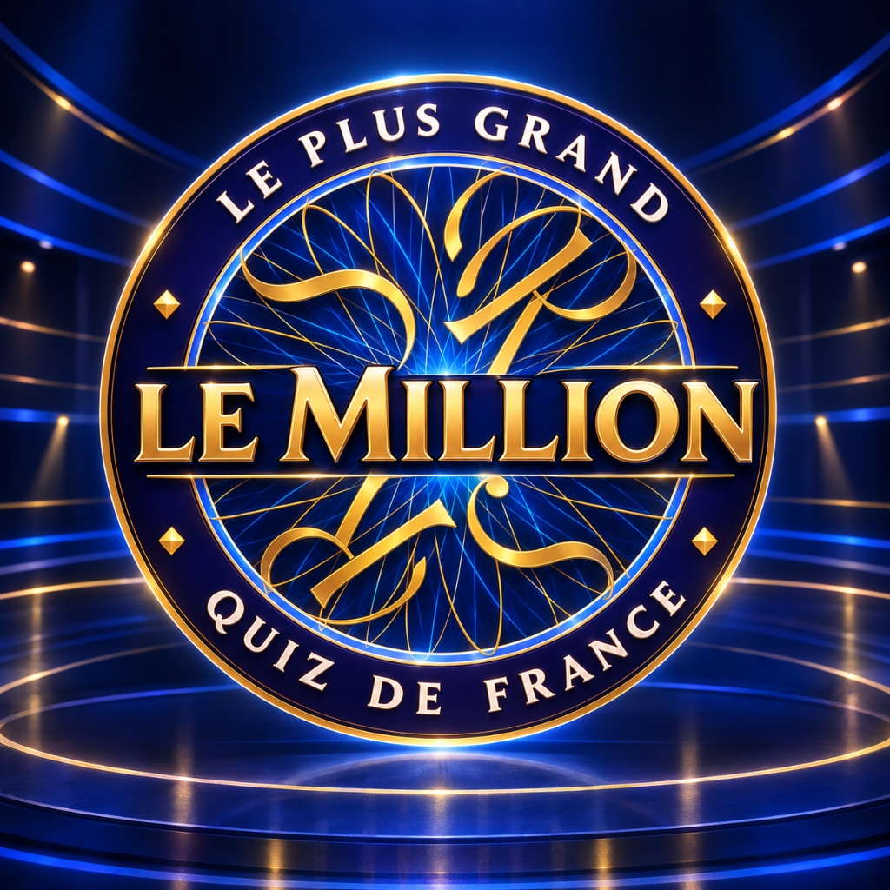

# 🏆 Le Million : Le Plus Grand Quiz de France

> Un jeu télévisé interactif et immersif en français inspiré de *"Qui veut gagner des millions ?"* et enrichi de la dynamique visuelle moderne de *Kahoot*.



---

## 🌟 Présentation du Projet

**Le Million** est une application web interactive complète conçue pour une expérience ludique en classe ou en solo. Entièrement rédigée en français de haute qualité, elle intègre une identité visuelle luxueuse aux tons bleu nuit, marine et or éclatant, ainsi que le logo officiel fourni.

### 🎯 Fonctionnalités Clés

1. **Expérience Télévisuelle & Immersion Complète**
   - **Écran d'accueil majestueux** avec le logo officiel mis en valeur par un halo doré, saisie du prénom du candidat et historique des scores.
   - **Plateau de jeu interactif** avec carte de question biseautée, badges de catégories et de niveau de difficulté.
   - **Système audio intégré (Web Audio API)** : battements de cœur pour le suspense, validation sonore, fanfares de bonne réponse, avertisseur d'erreur et sons d'ambiance (bouton muet/son disponible en haut à droite).
   - **Pluie de confettis** lors des victoires et des hauts scores !

2. **Mécaniques du Quiz**
   - **15 questions par partie**, sélectionnées aléatoirement parmi une banque de **45 questions vérifiées** réparties en 3 niveaux :
     - Questions 1 à 5 : *Facile* (Culture générale, sciences élémentaires, géographie)
     - Questions 6 à 10 : *Moyen* (Histoire, découvertes, littérature, arts)
     - Questions 11 à 15 : *Difficile* (Questions pointues dignes des grands maîtres de midi)
   - **10 thématiques variées** : *Sciences, Histoire, Géographie, Arts, Littérature, Sport, Société, Technologie, Nature, Culture générale*.
   - Choix parmi **4 réponses (A, B, C, D)** en grille 2×2 tactile (colonne simple sur smartphone).
   - Validation en 2 étapes : Sélection puis clic sur **« Valider mon choix »** pour ménager le suspense.
   - Feedback immédiat avec mise en valeur de la bonne réponse en vert émeraude, de la mauvaise en rouge pourpre, et affichage d'une **explication culturelle enrichissante**.

3. **Pyramide des Gains & Paliers de Sécurité**
   - Échelons progressifs de **100 € à 1 000 000 €**.
   - Deux paliers sécurisés garantis :
     - **Palier 1 (Q5) : 2 000 €**
     - **Palier 2 (Q10) : 100 000 €**
   - Affichage latéral sur ordinateur et tiroir escamotable sur mobile.

4. **Les 3 Jokers (utilisables une seule fois)**
   - **50:50** : Élimine instantanément deux mauvaises réponses.
   - **Avis du Public** : Affiche un graphique animé avec les pourcentages de vote réalistes des spectateurs en plateau.
   - **Changer de question** : Remplace la question en cours par une question inédite de même difficulté.

5. **Écran des Résultats Détaillé**
   - Montant final remporté (en tenant compte des paliers de sécurité garantis).
   - Score exact sur 15 et pourcentage de réussite.
   - Nombre de bonnes et mauvaises réponses.
   - Boutons **« Rejouer une partie »** et **« Retour à l'accueil »**.
   - Sauvegarde locale du palmarès des meilleurs scores dans le navigateur.

---

## 🚀 Comment Lancer le Projet

### Méthode 1 : En 1 clic (Windows)
Double-cliquez sur le fichier :
```
Lancer_Le_Jeu.bat
```
Ce script démarre le serveur local et ouvre automatiquement votre navigateur sur `http://localhost:4173`.

### Méthode 2 : En ligne de commande (npm)
```bash
# Lancer en mode développement avec rechargement à chaud
npm run dev

# Ou compiler la version de production et prévisualiser
npm run build
npm run preview
```

---

## 📁 Architecture du Code

```
French-project/
├── public/
│   └── logo.jpg               # Logo officiel du jeu
├── src/
│   ├── assets/
│   │   └── logo.jpg           # Copie du logo dans les sources
│   ├── types/
│   │   └── game.ts            # Définitions TypeScript (Question, Lifelines, etc.)
│   ├── data/
│   │   ├── questions.ts       # Banque de 45 questions équilibrées et vérifiées
│   │   └── prizes.ts          # Échelle des 15 gains et calcul des paliers
│   ├── services/
│   │   └── sound.ts           # Synthétiseur sonore Web Audio API
│   ├── context/
│   │   └── GameContext.tsx    # Gestionnaire d'état React global du jeu
│   ├── components/
│   │   ├── Header.tsx         # Barre supérieure avec logo, score et réglage son
│   │   ├── StartScreen.tsx    # Écran d'accueil avec logo en grand et saisie du prénom
│   │   ├── QuestionCard.tsx   # Carte de la question avec badges
│   │   ├── AnswerGrid.tsx     # Grille 2x2 des 4 choix (A, B, C, D)
│   │   ├── ValidationBar.tsx  # Bouton de validation, suspense et explications
│   │   ├── LifelinesBar.tsx   # Boutons des jokers (50:50, Public, Switch)
│   │   ├── AudienceModal.tsx  # Modale avec barres animées du vote du public
│   │   ├── PrizeLadder.tsx    # Pyramide des gains (sidebar bureau + drawer mobile)
│   │   ├── GameScreen.tsx     # Assemblage de l'arène de jeu
│   │   └── EndScreen.tsx      # Écran de fin avec statistiques et confettis
│   ├── App.tsx                # Routage conditionnel des écrans
│   ├── main.tsx               # Point d'entrée React
│   └── index.css              # Styles Tailwind et fonds d'ambiance
├── index.html                 # HTML avec polices Montserrat & Cinzel
├── package.json               # Dépendances (React, Tailwind, Lucide, Canvas Confetti)
├── tailwind.config.js         # Configuration Tailwind avec palette personnalisée
└── vite.config.ts             # Configuration Vite
```

---

## 🎨 Conception Visuelle & Accessibilité
- Palette de couleurs : `#020617` (Nuit profonde), `#0c1b4e` (Bleu plateau télévisé), `#facc15` (Or étincelant), `#10b981` (Vert victoire), `#ef4444` (Rouge défaite).
- Typographies : **Cinzel** pour les titres dorés prestigieux, **Montserrat** pour la lisibilité optimale des questions et réponses.
- Responsive design fluide testé sur smartphone, tablette et écran d'ordinateur.
